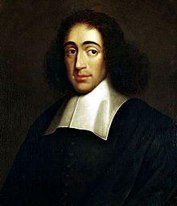

<table class="infobox biography vcard">
<tbody>
<tr>
<th colspan="2">

Baruch de Spinoza Benedictus de Spinoza

</th>
</tr>
<tr>
<td colspan="2"></td>
</tr>
<tr>
<th scope="row">Born</th>
<td>24 November 1632 

<a title="Amsterdam" href="https://en.wikipedia.org/wiki/Amsterdam">Amsterdam</a>,&nbsp;<a title="Dutch Republic" href="https://en.wikipedia.org/wiki/Dutch_Republic">Dutch Republic</a>

</td>
</tr>
<tr>
<th scope="row">Died</th>
<td>21 February 1677&nbsp;(aged&nbsp;44) 

<a title="The Hague" href="https://en.wikipedia.org/wiki/The_Hague">The Hague</a>, Dutch Republic

</td>
</tr>
<tr>
<th scope="row">Education</th>
<td><a title="Talmud Torah" href="https://en.wikipedia.org/wiki/Talmud_Torah">Talmud Torah</a>&nbsp;of Amsterdam <small>(withdrew)</small> <a class="mw-redirect" title="University of Leiden" href="https://en.wikipedia.org/wiki/University_of_Leiden">University of Leiden</a> <small>(no degree)</small></td>
</tr>
<tr>
<td colspan="2">&nbsp;</td>
</tr>
<tr>
<th scope="row">Era</th>
<td class="category"><a title="17th-century philosophy" href="https://en.wikipedia.org/wiki/17th-century_philosophy">17th-century philosophy</a> <a title="Age of Enlightenment" href="https://en.wikipedia.org/wiki/Age_of_Enlightenment">Age of Enlightenment</a></td>
</tr>
<tr>
<th scope="row">Region</th>
<td class="category"><a title="Western philosophy" href="https://en.wikipedia.org/wiki/Western_philosophy">Western philosophy</a></td>
</tr>
<tr>
<th scope="row"><a title="List of schools of philosophy" href="https://en.wikipedia.org/wiki/List_of_schools_of_philosophy">School</a></th>
<td class="category"><a title="Rationalism" href="https://en.wikipedia.org/wiki/Rationalism">Rationalism</a> <a title="Spinozism" href="https://en.wikipedia.org/wiki/Spinozism">Spinozism</a> <a title="Cartesianism" href="https://en.wikipedia.org/wiki/Cartesianism">Cartesianism</a> <a title="Foundationalism" href="https://en.wikipedia.org/wiki/Foundationalism">Foundationalism</a>&nbsp;(according to Hegel) <a title="Conceptualism" href="https://en.wikipedia.org/wiki/Conceptualism">Conceptualism</a> <a class="mw-redirect" title="Direct realism" href="https://en.wikipedia.org/wiki/Direct_realism">Direct realism</a> <a title="Correspondence theory of truth" href="https://en.wikipedia.org/wiki/Correspondence_theory_of_truth">Correspondence theory of truth</a></td>
</tr>
<tr>
<th scope="row">

Main interests

</th>
<td>Ethics,&nbsp;<a title="Epistemology" href="https://en.wikipedia.org/wiki/Epistemology">epistemology</a>,&nbsp;<a title="Metaphysics" href="https://en.wikipedia.org/wiki/Metaphysics">metaphysics</a>,&nbsp;<a class="mw-redirect" title="Hebrew Language" href="https://en.wikipedia.org/wiki/Hebrew_Language">Hebrew Language</a>,&nbsp;<a title="Hebrew Bible" href="https://en.wikipedia.org/wiki/Hebrew_Bible">Hebrew Bible</a></td>
</tr>
<tr class="note">
<th scope="row">

Notable ideas

</th>
<td>

<a title="Pantheism" href="https://en.wikipedia.org/wiki/Pantheism">Pantheism</a>,&nbsp;<a title="Determinism" href="https://en.wikipedia.org/wiki/Determinism">determinism</a>,&nbsp;<a title="Neutral monism" href="https://en.wikipedia.org/wiki/Neutral_monism">neutral monism</a>,&nbsp;<a title="Psychophysical parallelism" href="https://en.wikipedia.org/wiki/Psychophysical_parallelism">psychophysical parallelism</a>,&nbsp;<a title="Intellectual freedom" href="https://en.wikipedia.org/wiki/Intellectual_freedom">intellectual</a>&nbsp;and&nbsp;<a title="Freedom of religion" href="https://en.wikipedia.org/wiki/Freedom_of_religion">religious freedom</a>,&nbsp;<a title="Separation of church and state" href="https://en.wikipedia.org/wiki/Separation_of_church_and_state">separation of church and state</a>, criticism of&nbsp;<a title="Moses" href="https://en.wikipedia.org/wiki/Moses">Mosaic</a>&nbsp;

authorship of some books of the&nbsp;<a title="Hebrew Bible" href="https://en.wikipedia.org/wiki/Hebrew_Bible">Hebrew Bible</a>,&nbsp;<a class="mw-redirect" title="Forms of government" href="https://en.wikipedia.org/wiki/Forms_of_government">political society</a>&nbsp;as derived from&nbsp;<a class="mw-redirect" title="Power (sociology)" href="https://en.wikipedia.org/wiki/Power_(sociology)">power</a>&nbsp;(not&nbsp;<a title="Social contract" href="https://en.wikipedia.org/wiki/Social_contract">contract</a>),&nbsp;<a title="Affect (philosophy)" href="https://en.wikipedia.org/wiki/Affect_(philosophy)">affect</a>,&nbsp;<em><a title="Natura naturans" href="https://en.wikipedia.org/wiki/Natura_naturans">natura naturans</a></em>,&nbsp;<em><a title="Natura naturata" href="https://en.wikipedia.org/wiki/Natura_naturata">natura naturata</a></em>

</td>
</tr>
<tr class="note">
<td colspan="2">

Influences

<ul class="NavContent">
<li>

<a title="Ren&eacute; Descartes" href="https://en.wikipedia.org/wiki/Ren%C3%A9_Descartes">Descartes</a>,&nbsp;<a title="Stoicism" href="https://en.wikipedia.org/wiki/Stoicism">Stoics</a>,&nbsp;<a title="Maimonides" href="https://en.wikipedia.org/wiki/Maimonides">Maimonides</a>,<a title="Hasdai Crescas" href="https://en.wikipedia.org/wiki/Hasdai_Crescas">Crescas</a>,&nbsp;<a title="Abraham ibn Ezra" href="https://en.wikipedia.org/wiki/Abraham_ibn_Ezra">Abraham ibn Ezra</a>,&nbsp;<a title="Avicenna" href="https://en.wikipedia.org/wiki/Avicenna">Avicenna</a>,&nbsp;<a title="Averroes" href="https://en.wikipedia.org/wiki/Averroes">Averroes</a>,&nbsp;<a title="Aristotle" href="https://en.wikipedia.org/wiki/Aristotle">Aristotle</a>,&nbsp;<a title="Democritus" href="https://en.wikipedia.org/wiki/Democritus">Democritus</a>,&nbsp;<a title="Lucretius" href="https://en.wikipedia.org/wiki/Lucretius">Lucretius</a>,&nbsp;<a title="Epicurus" href="https://en.wikipedia.org/wiki/Epicurus">Epicurus</a>,&nbsp;<a class="mw-redirect" title="Niccolo Machiavelli" href="https://en.wikipedia.org/wiki/Niccolo_Machiavelli">Niccolo Machiavelli</a>,&nbsp;<a title="Thomas Hobbes" href="https://en.wikipedia.org/wiki/Thomas_Hobbes">Thomas Hobbes</a>,&nbsp;<a title="Giordano Bruno" href="https://en.wikipedia.org/wiki/Giordano_Bruno">Giordano Bruno</a>,&nbsp;<a title="Franciscus van den Enden" href="https://en.wikipedia.org/wiki/Franciscus_van_den_Enden">Franciscus van den Enden</a>,&nbsp;<a title="Menasseh Ben Israel" href="https://en.wikipedia.org/wiki/Menasseh_Ben_Israel">Menasseh Ben Israel</a>

</li>
</ul>

</td>
</tr>
<tr class="note">
<td colspan="2">

Influenced

<ul class="NavContent">
<li>

<a class="mw-redirect" title="Enlightenment philosophy" href="https://en.wikipedia.org/wiki/Enlightenment_philosophy">Enlightenment philosophy</a>&nbsp;(<a title="Age of Enlightenment" href="https://en.wikipedia.org/wiki/Age_of_Enlightenment">Age of Reason</a>),&nbsp;<a title="Arthur Schopenhauer" href="https://en.wikipedia.org/wiki/Arthur_Schopenhauer">Schopenhauer</a>,&nbsp;<a title="Jorge Luis Borges" href="https://en.wikipedia.org/wiki/Jorge_Luis_Borges">Borges</a>,&nbsp;<a title="Georg Wilhelm Friedrich Hegel" href="https://en.wikipedia.org/wiki/Georg_Wilhelm_Friedrich_Hegel">Hegel</a>,&nbsp;<a title="Jean-Jacques Rousseau" href="https://en.wikipedia.org/wiki/Jean-Jacques_Rousseau">Rousseau</a>,&nbsp;<a title="Friedrich Wilhelm Joseph Schelling" href="https://en.wikipedia.org/wiki/Friedrich_Wilhelm_Joseph_Schelling">Schelling</a>,&nbsp;<a title="Arne N&aelig;ss" href="https://en.wikipedia.org/wiki/Arne_N%C3%A6ss">N&aelig;ss</a>,&nbsp;<a class="mw-redirect" title="Karl Heinrich Marx" href="https://en.wikipedia.org/wiki/Karl_Heinrich_Marx">Marx</a>,&nbsp;<a title="Gabriel Wagner" href="https://en.wikipedia.org/wiki/Gabriel_Wagner">G. Wagner</a>,&nbsp;<a title="Donald Davidson (philosopher)" href="https://en.wikipedia.org/wiki/Donald_Davidson_(philosopher)">Davidson</a>,&nbsp;<a title="Gilles Deleuze" href="https://en.wikipedia.org/wiki/Gilles_Deleuze">Deleuze</a>,&nbsp;<a title="Albert Einstein" href="https://en.wikipedia.org/wiki/Albert_Einstein">Einstein</a>,&nbsp;<a title="George Eliot" href="https://en.wikipedia.org/wiki/George_Eliot">G. Eliot</a>,&nbsp;<a class="mw-redirect" title="Fichte" href="https://en.wikipedia.org/wiki/Fichte">Fichte</a>,&nbsp;<a class="mw-redirect" title="Johann Gottfried von Herder" href="https://en.wikipedia.org/wiki/Johann_Gottfried_von_Herder">Herder</a>,&nbsp;<a title="Novalis" href="https://en.wikipedia.org/wiki/Novalis">Novalis</a>,&nbsp;<a class="mw-redirect" title="Gottfried Leibniz" href="https://en.wikipedia.org/wiki/Gottfried_Leibniz">Leibniz</a>,&nbsp;<a title="Johann Wolfgang von Goethe" href="https://en.wikipedia.org/wiki/Johann_Wolfgang_von_Goethe">Goethe</a>,&nbsp;<a title="Charles Renouvier" href="https://en.wikipedia.org/wiki/Charles_Renouvier">Renouvier</a>,&nbsp;<a title="Friedrich Nietzsche" href="https://en.wikipedia.org/wiki/Friedrich_Nietzsche">Nietzsche</a>,&nbsp;<a title="Bertrand Russell" href="https://en.wikipedia.org/wiki/Bertrand_Russell">Russell</a>,&nbsp;<a title="Ludwig Wittgenstein" href="https://en.wikipedia.org/wiki/Ludwig_Wittgenstein">Wittgenstein</a>,&nbsp;<a title="Sigmund Freud" href="https://en.wikipedia.org/wiki/Sigmund_Freud">Freud</a>,&nbsp;<a title="Miguel de Unamuno" href="https://en.wikipedia.org/wiki/Miguel_de_Unamuno">Unamuno</a>,&nbsp;<a title="Louis Althusser" href="https://en.wikipedia.org/wiki/Louis_Althusser">Althusser</a>,&nbsp;<a title="&Eacute;tienne Balibar" href="https://en.wikipedia.org/wiki/%C3%89tienne_Balibar">Balibar</a>,&nbsp;<a title="Michael Hardt" href="https://en.wikipedia.org/wiki/Michael_Hardt">Hardt</a>,&nbsp;<a title="Evald Ilyenkov" href="https://en.wikipedia.org/wiki/Evald_Ilyenkov">Ilyenkov</a>,&nbsp;<a title="Antonio Negri" href="https://en.wikipedia.org/wiki/Antonio_Negri">Negri</a>,&nbsp;<a title="George Santayana" href="https://en.wikipedia.org/wiki/George_Santayana">Santayana</a>,&nbsp;

<a title="Samuel Taylor Coleridge" href="https://en.wikipedia.org/wiki/Samuel_Taylor_Coleridge">Coleridge</a>,&nbsp;<a title="Gotthold Ephraim Lessing" href="https://en.wikipedia.org/wiki/Gotthold_Ephraim_Lessing">Gotthold Ephraim Lessing</a>,&nbsp;<a title="Leo Strauss" href="https://en.wikipedia.org/wiki/Leo_Strauss">L. Strauss</a>,&nbsp;<a title="Leszek Kołakowski" href="https://en.wikipedia.org/wiki/Leszek_Ko%C5%82akowski">Kołakowski</a>,&nbsp;<a title="Irvin D. Yalom" href="https://en.wikipedia.org/wiki/Irvin_D._Yalom">Yalom</a>,&nbsp;<a title="Lev Vygotsky" href="https://en.wikipedia.org/wiki/Lev_Vygotsky">Vygotsky</a>

</li>
</ul>

</td>
</tr>
</tbody>
</table>
 

<strong>Baruch Spinoza</strong>&nbsp;(<a title="Help:IPA/English" href="https://en.wikipedia.org/wiki/Help:IPA/English">/bəˈruːk&nbsp;spɪˈnoʊzə/</a>,&nbsp;<small>Dutch:&nbsp;</small><a title="Help:IPA/Dutch" href="https://en.wikipedia.org/wiki/Help:IPA/Dutch">[baːˈrux spɪˈnoːzaː]</a>; born&nbsp;<strong>Benedito de Espinosa</strong>,&nbsp;Portuguese:&nbsp;<a title="Help:IPA/Portuguese" href="https://en.wikipedia.org/wiki/Help:IPA/Portuguese">[bɨnɨˈ&eth;itu &eth;ɨ ʃpiˈnɔzɐ]</a>; later&nbsp;<strong>Benedict de Spinoza</strong>; 24 November 1632 &ndash; 21 February 1677) was a Dutch philosopher of&nbsp;<a title="Sephardi Jews" href="https://en.wikipedia.org/wiki/Sephardi_Jews">Portuguese Sephardi</a>&nbsp;origin.&nbsp;One of the early thinkers of the&nbsp;<a title="Age of Enlightenment" href="https://en.wikipedia.org/wiki/Age_of_Enlightenment">Enlightenment</a>&nbsp;and modern&nbsp;<a title="Biblical criticism" href="https://en.wikipedia.org/wiki/Biblical_criticism">biblical criticism</a>,&nbsp;including modern conceptions of the self and the universe,&nbsp;he came to be considered one of the great&nbsp;<a title="Rationalism" href="https://en.wikipedia.org/wiki/Rationalism">rationalists</a>&nbsp;of&nbsp;<a title="17th-century philosophy" href="https://en.wikipedia.org/wiki/17th-century_philosophy">17th-century philosophy</a>.&nbsp;Inspired by the groundbreaking ideas of&nbsp;<a title="Ren&eacute; Descartes" href="https://en.wikipedia.org/wiki/Ren%C3%A9_Descartes">Ren&eacute; Descartes</a>, Spinoza became a leading philosophical figure of the&nbsp;<a title="Dutch Golden Age" href="https://en.wikipedia.org/wiki/Dutch_Golden_Age">Dutch Golden Age</a>. Spinoza's given name, which means "Blessed", varies among different languages. In Hebrew, it is written&nbsp;ברוך שפינוזה. His Portuguese name is&nbsp;<em lang="pt" title="Portuguese language text">Benedito "Bento" de Espinosa</em>&nbsp;or&nbsp;<em lang="pt" title="Portuguese language text">d'Espinosa</em>. In his Latin works, he used Latin:&nbsp;<em lang="la">Benedictus de Spinoza</em>.

Spinoza was raised in the Portuguese-Jewish community in&nbsp;<a title="Amsterdam" href="https://en.wikipedia.org/wiki/Amsterdam">Amsterdam</a>. He developed highly controversial ideas regarding the authenticity of the&nbsp;<a title="Hebrew Bible" href="https://en.wikipedia.org/wiki/Hebrew_Bible">Hebrew Bible</a>&nbsp;and the nature of the&nbsp;<a title="God" href="https://en.wikipedia.org/wiki/God">Divine</a>.&nbsp;<a title="Portuguese Synagogue (Amsterdam)" href="https://en.wikipedia.org/wiki/Portuguese_Synagogue_(Amsterdam)">Jewish religious authorities</a>&nbsp;issued a&nbsp;<em><a title="Herem (censure)" href="https://en.wikipedia.org/wiki/Herem_(censure)">herem</a></em>&nbsp;(חרם) against him, causing him to be effectively expelled and shunned by Jewish society at age 23, including by his own family. His books were later added to the&nbsp;<a title="Catholic Church" href="https://en.wikipedia.org/wiki/Catholic_Church">Catholic Church</a>'s&nbsp;<em><a title="Index Librorum Prohibitorum" href="https://en.wikipedia.org/wiki/Index_Librorum_Prohibitorum">Index of Forbidden Books</a></em>. He was frequently called an "atheist" by contemporaries, although nowhere in his work does Spinoza argue against the&nbsp;<a title="Existence of God" href="https://en.wikipedia.org/wiki/Existence_of_God">existence of God</a>.

Spinoza lived an outwardly simple life as an optical&nbsp;<a class="mw-redirect" title="Lens (optics)" href="https://en.wikipedia.org/wiki/Lens_(optics)">lens</a>&nbsp;grinder, collaborating on microscope and telescope lens designs with&nbsp;<a title="Constantijn Huygens Jr." href="https://en.wikipedia.org/wiki/Constantijn_Huygens_Jr.">Constantijn</a>&nbsp;and&nbsp;<a title="Christiaan Huygens" href="https://en.wikipedia.org/wiki/Christiaan_Huygens">Christiaan Huygens</a>. He turned down rewards and honours throughout his life, including prestigious teaching positions. He died at the age of 44 in 1677 from a lung illness, perhaps&nbsp;<a title="Tuberculosis" href="https://en.wikipedia.org/wiki/Tuberculosis">tuberculosis</a>&nbsp;or&nbsp;<a title="Silicosis" href="https://en.wikipedia.org/wiki/Silicosis">silicosis</a>&nbsp;exacerbated by the inhalation of fine glass dust while grinding lenses. He is buried in the Christian churchyard of&nbsp;<a title="Nieuwe Kerk (The Hague)" href="https://en.wikipedia.org/wiki/Nieuwe_Kerk_(The_Hague)">Nieuwe Kerk</a>&nbsp;in&nbsp;<a title="The Hague" href="https://en.wikipedia.org/wiki/The_Hague">The Hague</a>.

Spinoza's&nbsp;<em><a title="Masterpiece" href="https://en.wikipedia.org/wiki/Masterpiece">magnum opus</a></em>, the&nbsp;<em><a title="Ethics (Spinoza)" href="https://en.wikipedia.org/wiki/Ethics_(Spinoza)">Ethics</a></em>, was published posthumously in the year of his death. The work opposed Descartes' philosophy of&nbsp;<a title="Mind&ndash;body dualism" href="https://en.wikipedia.org/wiki/Mind%E2%80%93body_dualism">mind&ndash;body dualism</a>, and earned Spinoza recognition as one of&nbsp;<a title="Western philosophy" href="https://en.wikipedia.org/wiki/Western_philosophy">Western philosophy</a>'s most important thinkers. In it, "Spinoza wrote the last indisputable Latin masterpiece, and one in which the refined conceptions of medieval philosophy are finally turned against themselves and destroyed entirely".&nbsp;<a title="Georg Wilhelm Friedrich Hegel" href="https://en.wikipedia.org/wiki/Georg_Wilhelm_Friedrich_Hegel">Georg Wilhelm Friedrich Hegel</a>&nbsp;said, "The fact is that Spinoza is made a testing-point in modern philosophy, so that it may really be said: You are either a Spinozist or not a philosopher at all."&nbsp;His philosophical accomplishments and moral character prompted&nbsp;<a title="Gilles Deleuze" href="https://en.wikipedia.org/wiki/Gilles_Deleuze">Gilles Deleuze</a>&nbsp;to name him "the 'prince' of philosophers."

 
<h2> Books </h2>

<ul>
 <li><a target="_blank" href="https://github.com/manjunath5496/Baruch-Spinoza-Books/blob/master/oza(1).pdf" style="text-decoration:none;">Spinoza's works: Volume 1</a></li>
  
<li><a target="_blank" href="https://github.com/manjunath5496/Baruch-Spinoza-Books/blob/master/oza(2).pdf" style="text-decoration:none;">A Spinoza Reader: The Ethics and Other Works</a></li>  
  
<li><a target="_blank" href="https://github.com/manjunath5496/Baruch-Spinoza-Books/blob/master/oza(3).pdf" style="text-decoration:none;">On the Improvement of the Understanding</a></li>

 
<li><a target="_blank" href="https://github.com/manjunath5496/Baruch-Spinoza-Books/blob/master/oza(4).pdf" style="text-decoration:none;">Treatise on Theology and Politics</a></li>
                               
  <li><a target="_blank" href="https://github.com/manjunath5496/Baruch-Spinoza-Books/blob/master/oza(5).pdf" style="text-decoration:none;"> Short treatise on God, man and his well being </a></li>   

 <li><a target="_blank" href="https://github.com/manjunath5496/Baruch-Spinoza-Books/blob/master/oza(6).pdf" style="text-decoration:none;">Spinoza: Complete Works</a></li>
 
  <li><a target="_blank" href="https://github.com/manjunath5496/Baruch-Spinoza-Books/blob/master/oza(7).pdf" style="text-decoration:none;">The Rationalists: Descartes: Discourse on Method and Meditations; Spinoza: Ethics; Leibniz: Monadology and Discourse on Metaphysics  </a></li>   

 
               
 </ul>
